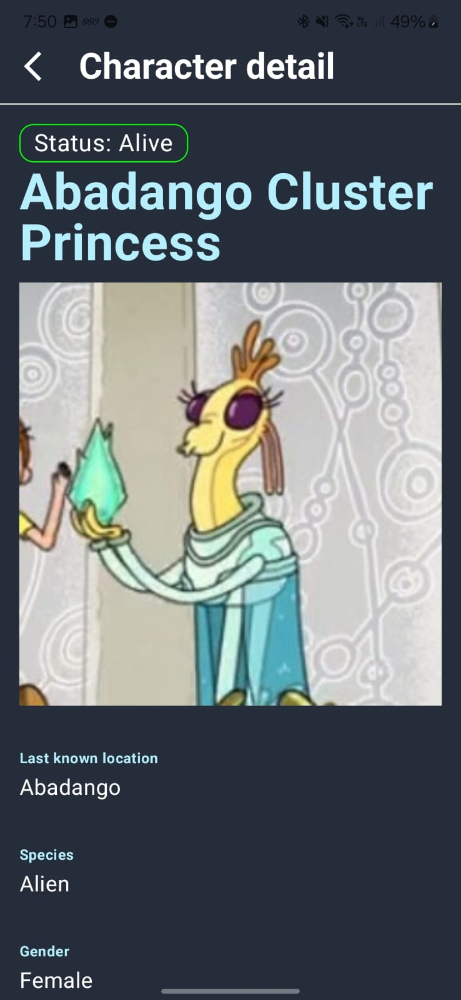

# RickAndMorty

¡Bienvenido a RickAndMorty! 🎉

Ees una aplicación que te permite explorar y descubrir información sobre tus personajes favoritos de Rick and Morty. Con una interfaz intuitiva y un diseño atractivo, puedes ver detalles, y más.

## Tecnologías Utilizadas

- **Lenguaje**: Kotlin
- **Framework**: Jetpack Compose
- **Navegación**: Navigation Component
- **Gestión de dependencias**: Dagger Hilt
- **Networking**: Ktor
- **Imágenes**: Coil
- **Arquitectura**: MVVM combinado con arquitectura modular

## Características

- Navegación fácil a través de los personajes de Rick and Morty.
- Interfaz de usuario atractiva y responsiva.
- Información detallada sobre cada personaje.

## Capturas de Pantalla

Aquí hay algunas capturas de pantalla de la aplicación:
| Pantalla Principal                                    | Detalles del Personaje                             |
|------------------------------------------------------|----------------------------------------------------|
|  | |

## Instalación
Para instalar RickAndMorty, clona el repositorio y sigue estos pasos:

1. Abre Android Studio.
2. Selecciona "Import Project" y elige la carpeta del proyecto clonado.
3. Espera a que se sincronicen las dependencias.
4. Conecta tu dispositivo o inicia un emulador.
5. Ejecuta la aplicación.

## Uso

1. Abre la aplicación.
2. Explora la lista de personajes.
3. Toca un personaje para ver más detalles.

## Licencia

Este proyecto está bajo la [Licencia MIT](LICENSE).

## Contacto

Si tienes alguna pregunta o sugerencia, no dudes en contactarme mandandome un [correo](mailto:angel.angeles.molina@gmail.com).

---

¡Gracias por visitar wikiDisney! 🎈
